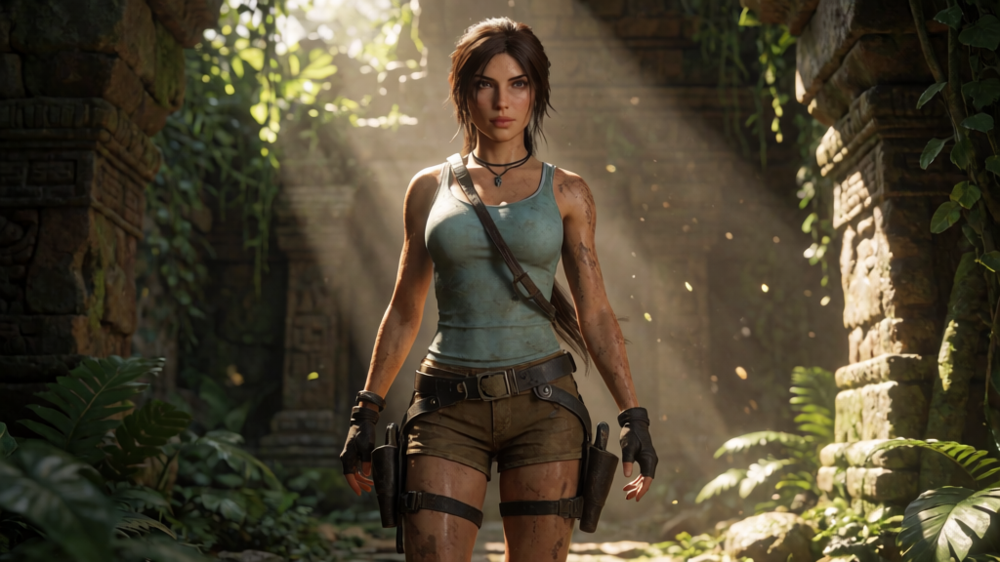
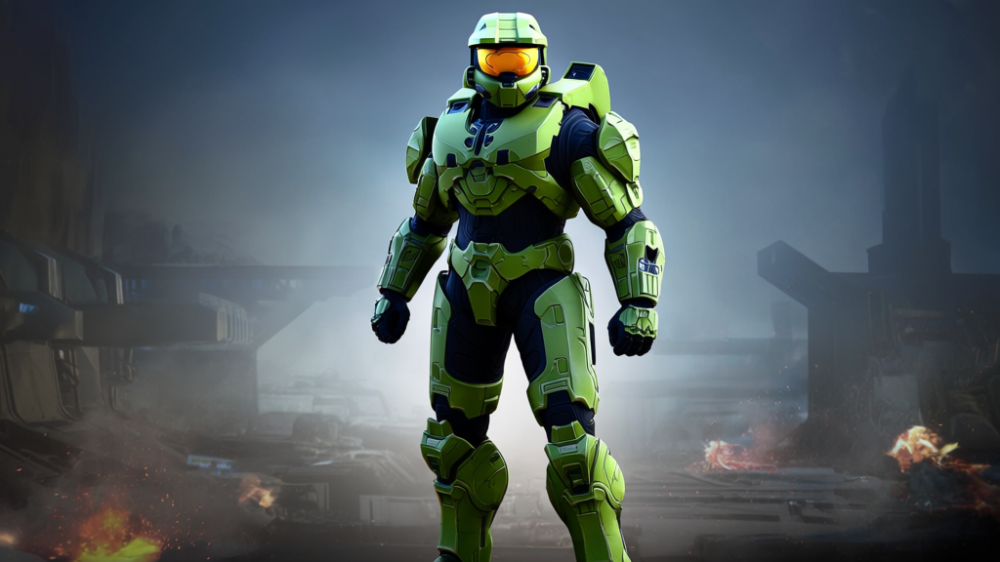
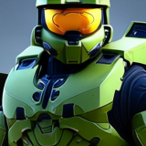
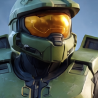

# Krea 2 Raw vs. Turbo in ComfyUI: Is Raw Worth the Wait? (Local Preview)

*Author: Mick*  
*Date: July 14, 2026*

This guide walks through my benchmark tests comparing **Krea 2 Raw** and **Krea 2 Turbo** under real local ComfyUI setups on an RTX 3060 12GB. I also wanted to see how the Raw base model behaves when paired with the official Turbo LoRA at a partial strength of 0.7 over 12 steps.

---

## 1. Introduction

When Krea 2 released, I was excited to compare the distilled, fast-rendering Turbo model with the high-fidelity Raw base checkpoint. In theory, the Raw model is designed to offer more creative flexibility and structural control, while Turbo is optimized for rapid concept generation. 

However, getting Raw to work correctly in ComfyUI requires navigating a few configuration hurdles. After sorting out the settings, I ran a series of comparisons using highly recognizable characters. Famous pop-culture properties make visual defects in silhouettes, faces, and materials much easier to recognize than abstract creature prompts.

---

## 2. Why the Initial Raw Workflow Was Wrong

My first Raw workflow failed because it did not reproduce Krea 2 Raw’s official guidance and timestep configuration. It combined the wrong scheduler with zeroed conditioning instead of a genuinely encoded empty prompt, and it mapped the model’s two-branch CFG process incorrectly. This caused the latent vectors to blow up, generating severe pointillistic noise and chromatic artifacts. 

I also tried a single-batch workflow using only a `FluxGuidance` node with sampler CFG set to 1.0. While this setup was clean of pointillistic noise, the image quality remained poor. The model struggled to resolve prompt details, silhouettes became muddy, and anatomical features lost their structure. 

To fix this, I implemented the validated Raw workflow. This setup does use two conditional/unconditional model evaluations through the `CFGGuider` node set to `cfg = 3.5`, routing the positive prompt normally and routing an empty string `""` on the negative conditioning path. To handle the timestep scheduler accurately, I coupled ComfyUI's standard `ModelSamplingFlux` node (to shift timesteps according to the image resolution) with a `BasicScheduler` set to `scheduler = simple`. This configuration resolved all chromatic noise and generated clean, high-fidelity images.

---

## 3. Hardware and Models

I tested the models on a standard mid-range desktop system:
*   **GPU**: NVIDIA GeForce RTX 3060 12GB (PCIe 3.0 x16 connection)
*   **System RAM**: 64 GB
*   **Resolution**: 1024x576 (Aspect ratio 16:9)
*   **Text Encoder**: `qwen3vl_4b_fp8_scaled.safetensors`
*   **VAE**: `qwen_image_vae.safetensors`

---

## 4. Correct Raw and Turbo Workflows

Here are the exact configurations used for each test:

*   **Krea 2 Turbo**: Uses `krea2_turbo_fp8_scaled.safetensors` as the base model, sampled for 8 steps at CFG 1.0 using the `beta57` scheduler. A `ConditioningZeroOut` node is applied to the negative path.
*   **Krea 2 Raw**: Uses `krea2_raw_fp8_scaled.safetensors` as the base model, sampled for 52 steps at CFG 3.5 using the `simple` scheduler and `CFGGuider` with an empty string negative prompt.
*   **Krea 2 Raw + Turbo LoRA**: Uses `krea2_raw_fp8_scaled.safetensors` as the base model, loaded with the official `krea2_turbo_lora_rank_64_bf16.safetensors` at 0.7 strength. It is sampled for 12 steps at CFG 1.0 using the `beta57` scheduler and a `ConditioningZeroOut` negative path.

---

## 5. Benchmark Method

I ran warm generations for each model variant using Lara Croft and Master Chief prompts. Testing recognizable characters allowed me to easily check visual errors in facial features, body proportions, armor plating, and hard-surface wear. Warm runs were measured to exclude the initial model loading time from the timings.

---

## 6. Corrected Timing Results

Comparing the timings shows a significant speed difference between the workflows. I ran a timing-validation suite to isolate the warm timings from ComfyUI's aggressive caching:

| Variant | Steps | LoRA Strength | Warm Total Time | Warm Sampler Time | Peak VRAM |
| :--- | :---: | :---: | :---: | :---: | :---: |
| **Krea 2 Turbo** | 8 | — | 39.50s | 27.22s | 11,859 MB |
| **Krea 2 Raw + Turbo LoRA** | 12 | 0.7 | 55.23s | 43.37s | 11,774 MB |

*Note: For the standalone Krea 2 Raw model (52 steps), a warm total generation takes 361.77 seconds. Standalone Raw is approximately 6.5x slower than native Turbo.*

### Caching and Switch Overhead Insights:
*   **Measurement Caching**: My initial tests reported near-identical timings (~52s vs ~53s) because ComfyUI cached repeated runs of identical seed/prompt inputs. When the workflow inputs, prompt, seed, and parameters remained unchanged, ComfyUI reused previously computed node outputs instead of performing a new generation. Isolating the uncached runs reveals that Raw + Turbo LoRA (12 steps) has a **measurable warm-time cost (+39.8% total workflow time, +59.3% sampler execution time)** over Turbo (8 steps). This matches the expected 1.5x step count difference.
*   **Reload Overhead**: 
    *   **Full startup**: Restarting the ComfyUI server and loading the model from scratch adds **90–100 seconds**.
    *   **Checkpoint switch**: Swapping active checkpoints on a running server adds **~20 seconds** of PCIe weight-paging.
    *   **LoRA application**: Applying or modifying the LoRA on top of an already loaded Raw checkpoint adds only **~0.7 seconds**.
*   **Workflow Benefit**: Because Raw and Raw + LoRA share the same base checkpoint, switching between them in a workspace is instantaneous (~0.7s), avoiding the 20-second checkpoint reload delay.

---

## 7. Image Quality: Turbo vs Raw vs Raw + Turbo LoRA

The visual results reveal how each model translates text prompts into final key-art.

### Character and Material Test: Lara Croft

This prompt was chosen to judge how well each model handles face structure, hair strands, clothing textures, and overall environment details. 

#### Local Markdown Preview:

#### CMS Shortcode:
[[compare:images/lara_turbo_8_52001.png|Turbo — 8 steps,images/lara_raw_52_52001.png|Raw — 52 steps,images/lara_raw_turbolora_12_52001.png|Raw + Turbo LoRA — 12 steps · strength 0.7]]

The standalone Raw model (52 steps) chose a full-body composition but rendered smooth, plastic-like skin and clothing, resembling a basic 3D game asset. Turbo (8 steps) produced a closer shot with detailed skin texture, hair definition, and rich foliage. 

The Turbo LoRA changed the behavior of the Raw model entirely. At 12 steps, it matched the photorealistic detail and texture quality of the native Turbo checkpoint while preserving a slightly softer, more natural lighting style.

#### Close-up Face & Hair Comparison

##### Local Markdown Preview:

##### CMS Shortcode:
[[compare:images/crops/lara_turbo_detail.png|Turbo detail,images/crops/lara_raw_detail.png|Raw detail,images/crops/lara_raw_turbolora_detail.png|Raw + Turbo LoRA detail]]

---

### Armor and Hard-Surface Test: Master Chief

This prompt evaluates rigid armor plating, metallic paint scuffs, visor reflections, and atmospheric battlefield effects.

#### Local Markdown Preview:

#### CMS Shortcode:
[[compare:images/chief_turbo_8_52002.png|Turbo — 8 steps,images/chief_raw_52_52002.png|Raw — 52 steps,images/chief_raw_turbolora_12_52002.png|Raw + Turbo LoRA — 12 steps · strength 0.7]]

The standalone Raw model generated a flat, saturated lime-green suit of armor with a solid orange visor. The background details and lighting remained very simple. 

Both Turbo and Raw + Turbo LoRA resolved the design, rendering detailed panel seams, scuffs on the metal chest plate, environment reflections in the gold visor, and volumetric sparks and smoke in the background.

#### Close-up Visor & Armor Comparison

##### Local Markdown Preview:

##### CMS Shortcode:
[[compare:images/crops/chief_turbo_detail.png|Turbo detail,images/crops/chief_raw_detail.png|Raw detail,images/crops/chief_raw_turbolora_detail.png|Raw + Turbo LoRA detail]]

---

### Is the Turbo LoRA Worth the Extra Time?

After correcting the timing method, the difference became much clearer. Native Turbo completed a warm 8-step generation in 39.50 seconds, while Raw with the official Turbo LoRA required 55.23 seconds at 12 steps.

That is a 39.8% increase in total workflow time and a 59.3% increase in sampler time. The sampler difference is close to the expected increase from moving from 8 to 12 steps.

In these two comparisons, the additional 15 to 16 seconds produced results that were visually comparable to native Turbo while offering a different composition and slightly softer rendering. I would still use Turbo as the default for fast iteration, but Raw with the Turbo LoRA is now a genuinely useful alternative rather than a compromise.

The earlier near-identical timing results were invalid because ComfyUI reused cached node outputs when the prompt, seed, and workflow remained unchanged.

---

## 8. What I Would Actually Use

In practice, my choices are based on the specific workflow requirements:

### Krea 2 Turbo
I use it as the default choice when:
*   Speed is the priority.
*   I want fast prompt iteration.
*   The simplest workflow is preferred.
*   I need polished, high-contrast outputs immediately.

### Raw + Official Turbo LoRA
I use it when:
*   An additional 16 seconds of generation time is acceptable.
*   I prefer a different composition or softer rendering.
*   The Raw checkpoint is already active in my workspace, allowing me to avoid reload times.
*   Fine control over style is needed via the LoRA strength slider.
*   Experimenting with the base Raw checkpoint is part of the creative process.

### Standalone Raw
I use it mainly for:
*   Training or evaluating LoRAs.
*   Testing base-checkpoint behaviors.
*   Academic research.
*   Workflows where rendering speed and immediate polish are not the priority.

---

## 9. Workflows and Prompt Downloads

You can download ComfyUI workflows and prompt setups from the companion repository:
*   [Krea 2 Workflows and Prompts](https://github.com/comfy-org-community/krea-2-comfyui-tutorial-workflows)

Model files can be retrieved from the [Comfy-Org Krea-2 Hugging Face Repository](https://huggingface.co/Comfy-Org/Krea-2/tree/main).

---

## 10. Verdict

The corrected Raw workflow gave me a valid baseline, but the comparison also showed why Turbo is the default inference model. Raw alone remained slower and less polished in these tests. Applying the official Turbo LoRA to Raw successfully recovered the rendering quality of Turbo, but at a warm-time cost of 39.8% (~15.73 seconds). For my own game-art workflow, I would choose Turbo for speed, and keep the Raw + LoRA hybrid setup for projects where avoiding model switching overhead is important.

---

## 11. Limitations

*   I tested only two prompts, both using recognizable licensed characters for technical comparison purposes.
*   Measurements were taken on a single RTX 3060 12GB system.
*   I used one seed per prompt to ensure a direct visual comparison.
*   Visual-quality judgments are partly subjective.
*   I tested one practical Turbo LoRA configuration (0.7 strength, 12 steps) rather than conducting a full parameter sweep.
*   Raw may show more composition diversity across multiple seeds than a single-image test reveals.
*   The pop-culture images are diagnostic fan-art examples used to make visual defects easier to recognize. They are not official promotional assets.
